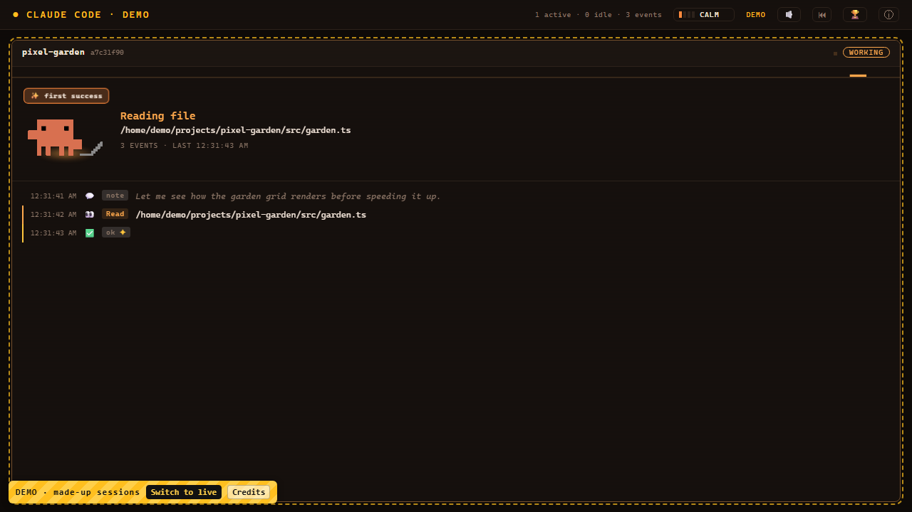
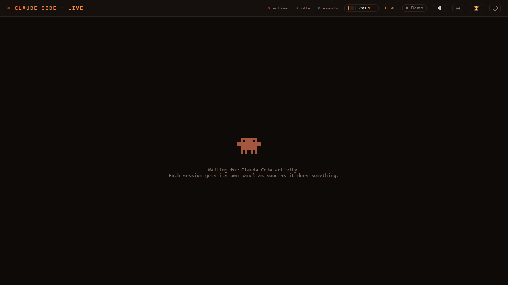
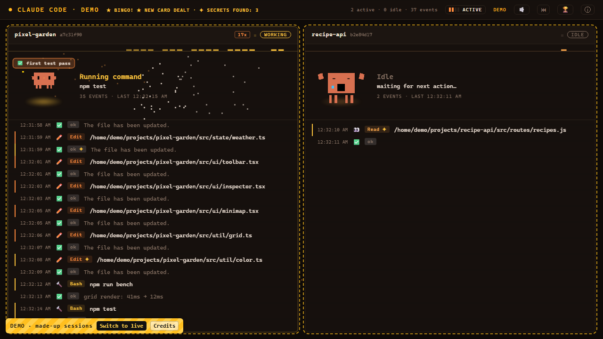
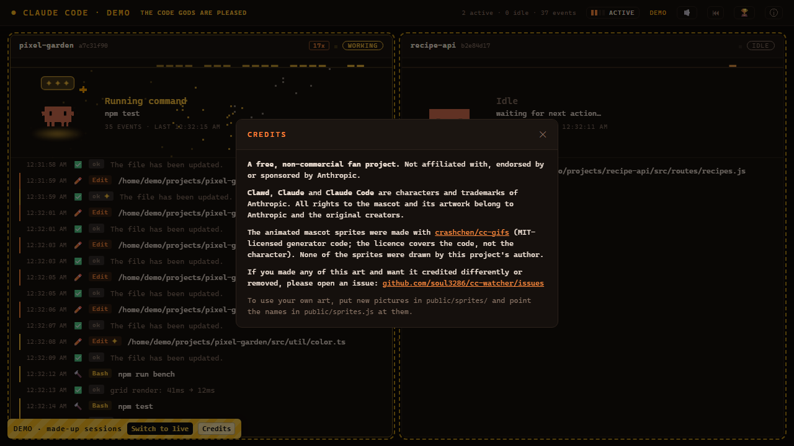
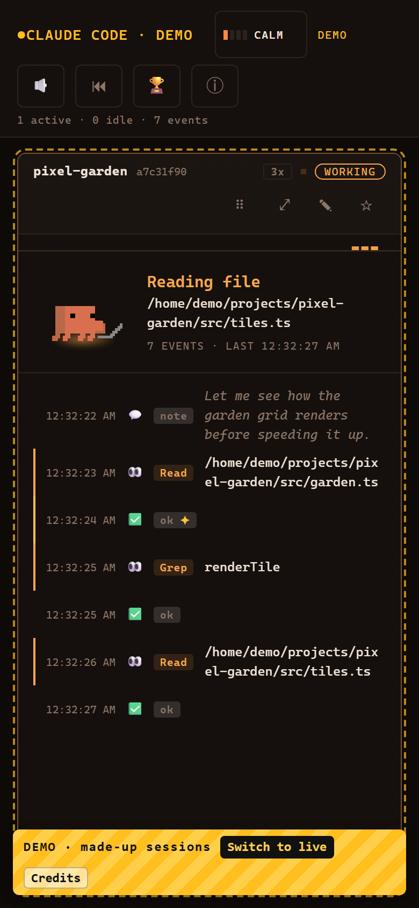

# CC Watcher — Setup Guide

Step by step, from download to Clawd on your phone. Every step says what you should see, so you know it worked.

## 1. What you need

- A computer with **Windows 10/11**, **macOS** or **Linux**.
- **Claude Code**, used at least once. CC Watcher reads the logs Claude Code keeps in `~/.claude/projects`. (It also works before that. It picks them up as soon as they appear.)
- An internet connection **for the first run only**. It downloads Node.js, if you don't have it yet, plus two small libraries.

## 2. Install and first run

**Windows**

1. Unzip `cc-watcher-1.0.0.zip` anywhere you like. A normal folder such as `Documents` is safest. Avoid folders synced by OneDrive or Dropbox.
2. Double-click **`start.bat`**. A black window opens.
3. If Node.js isn't installed, it installs it for you with winget. Windows may ask for permission: say **Yes**.
4. The first time, it installs its libraries. You'll see "Installing libraries - first run only...".
5. Windows Firewall may ask about Node.js. **Allow** is only needed if you want to use your phone (step 5). Cancel is fine otherwise.
6. Your browser opens **http://localhost:4790**. You'll see the dashboard.

**Keep the black window open.** Closing it stops CC Watcher. Minimising it is fine.

**Mac / Linux**

1. Unzip the folder, open a terminal in it and run **`sh start.sh`**.
2. If Node.js is missing, it installs it with Homebrew. If you don't have Homebrew, nodejs.org opens instead: install the LTS version and run `sh start.sh` again.
3. Your browser opens **http://localhost:4790**. Press Ctrl+C in the terminal to stop.

## 3. Demo mode vs your real sessions

If no Claude Code session is running, you'll see the **demo**: made-up projects that show off everything the dashboard does. A demo always looks like one:

- a striped yellow **DEMO** badge in the bottom-left corner,
- dashed outlines around the panels,
- the status at the top says **DEMO**.

Click **Switch to live** on the badge to see your real sessions. With nothing running yet, you'll see "Waiting for Claude Code activity…":

- **▶ Demo** (top bar) brings the demo back. Your choice is remembered.
- If a real session starts while the demo is playing, the badge tells you. It never switches by itself.
- The demo keeps its own progress. It never touches your real stats, streaks or badges.

## 4. Using it with Claude Code

1. Start Claude Code in any project, as you normally do.
2. As soon as Claude does something (reads a file, edits, runs a command), a panel for that session appears, with Clawd acting it out.
3. More sessions get more panels, side by side.

- Quiet sessions move to the dock at the bottom. After 30 minutes of nothing, Clawd falls asleep.
- **⏮ Replay** plays back a past session (Claude Code keeps logs for about 30 days).
- **🏆** shows your totals, records and badges. You can reset them there.
- **ⓘ** opens the credits.

## 5. On your phone

Your phone needs to reach the computer that runs CC Watcher. Pick one option.

**Option A — same Wi-Fi (simplest)**

1. Find your computer's address:
   - **Windows:** press Win+R, type `cmd`, press Enter, type `ipconfig` and press Enter. Look for **IPv4 Address**, something like `192.168.1.23`.
   - **Mac:** System Settings → Wi-Fi → **Details** next to your network → IP address.
2. On the phone, open `http://<that address>:4790`, for example `http://192.168.1.23:4790`.
3. If it doesn't load, the firewall is blocking it. On Windows, allow Node.js in Windows Security → Firewall & network protection → **Allow an app through firewall**.

**Option B — anywhere, with HTTPS (via Tailscale)**

1. Install [Tailscale](https://tailscale.com) on the computer and the phone, signed in to the same account.
2. With CC Watcher running, run this on the computer: `tailscale serve --bg 4790`
3. It prints an address like `https://your-pc.your-tailnet.ts.net`. Open that on the phone. Only your own devices can reach it.
4. To stop sharing: `tailscale serve --https=443 off`

**Add it to your home screen**

- **iPhone (Safari):** Share → **Add to Home Screen**.
- **Android (Chrome):** ⋮ menu → **Install app** (or Add to Home screen). Installing as a full app needs Option B.

If the phone loses the connection (the computer is asleep, the black window was closed, Tailscale is off), a red banner says so. It never pretends to be live.

## 6. Desktop mascot (Windows, optional)

A small floating Clawd on your desktop, showing the most important thing across all your sessions.

1. Download **`CC.Live.Setup.1.0.0.exe`** from the [Releases page](../../releases).
2. Run it. It isn't code-signed, so Windows SmartScreen asks once: click **More info → Run anyway**.
3. Clawd appears on your desktop. The installer includes its own watcher, so you don't need the zip for it.

| To… | Do this |
|---|---|
| Move Clawd | Drag him |
| Toys and games | Click him |
| Full dashboard | Double-click him, or **Ctrl+Alt+D** |
| Hide / show Clawd | **Ctrl+Alt+M** |
| Always on top, mute sound, launch at login, quit | Right-click the tray icon (bottom-right, near the clock) |

Its settings are kept in `%APPDATA%\CC Live\desktop.json`. If you run both the desktop app and the zip version, whichever starts first on port 4790 serves both, and they share its progress.

## 7. Start it automatically (optional)

- **Desktop app:** tray icon → tick **Launch at login**.
- **Zip version on Windows:** right-click `start.bat` → **Create shortcut**. Press Win+R, type `shell:startup` and press Enter, then move the shortcut into the folder that opens. CC Watcher now starts when you log in.

## 8. Updating and removing

**Update:** download the new zip and unzip it over the old folder. Your `progress.json` (totals, records, badges) stays.

**Remove:**
- Zip version: close the black window and delete the folder.
- Desktop app: Settings → Apps → **CC Live** → Uninstall.

Nothing else is left behind, except the page's saved settings in your browser.

## 9. Troubleshooting

| Problem | Try this |
|---|---|
| Nothing appears when I use Claude Code | Is the page in live mode (no DEMO badge)? Has Claude Code done something yet? Is there anything in `%USERPROFILE%\.claude\projects` (Windows) or `~/.claude/projects` (Mac/Linux)? |
| Red banner: can't reach the watcher | The black window was closed. Double-click `start.bat` (or run `sh start.sh`) again. |
| It says "already running" | Another copy is running. It opens that one. That's fine. |
| Port 4790 is used by something else | Pick another port. Windows: in a terminal in the folder, run `set PORT=4800` then `start.bat`. Mac/Linux: `PORT=4800 sh start.sh`. |
| Phone can't connect | Same Wi-Fi as the computer? Node.js allowed through the firewall? Or use Tailscale (Option B). |
| Node.js install failed | Install the LTS version from [nodejs.org](https://nodejs.org), then run start again. |
| Mac/Linux: "permission denied" | Run `sh start.sh`, not `./start.sh`. |
| Desktop app is blocked by Windows | SmartScreen → **More info → Run anyway**. |

Still stuck? Open an issue on the GitHub page.

## 10. Privacy

CC Watcher only **reads** Claude Code's own log files on your computer. Nothing is uploaded anywhere, and there are no trackers. The only file it writes is `progress.json` next to `server.js`, which holds your totals, records and badges. Demo mode never touches your real stats.
